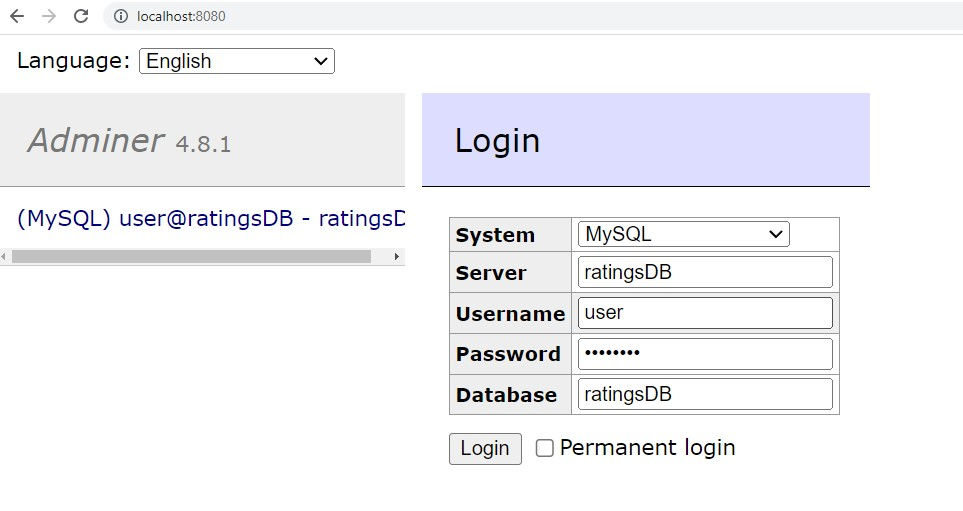

This folder contains a docker file that build a mysql image and creates the tables defined in ddl.sql
It should be persistent using the volume mysql_data.

The first time you run `docker compose up --build` will be very slow (up to 10 mins), **but make sure you wait until you see this log**:
```
[Server] /usr/sbin/mysqld: ready for connections. Version: '8.0.32'  socket: '/var/run/mysqld/mysqld.sock'  port: 3306  MySQL Community Server - GPL.
```


After it starts, there will be a UI at 8080:


password is `password`